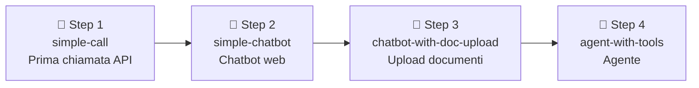
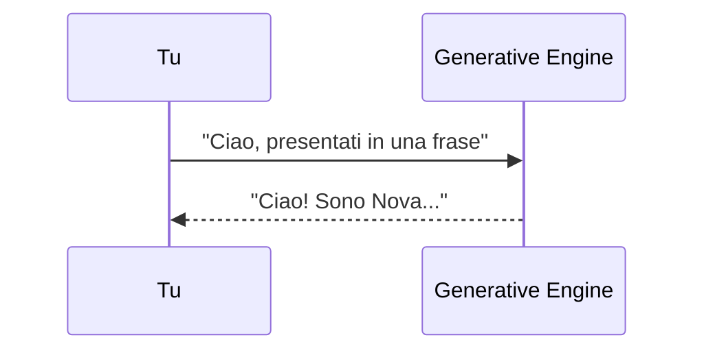
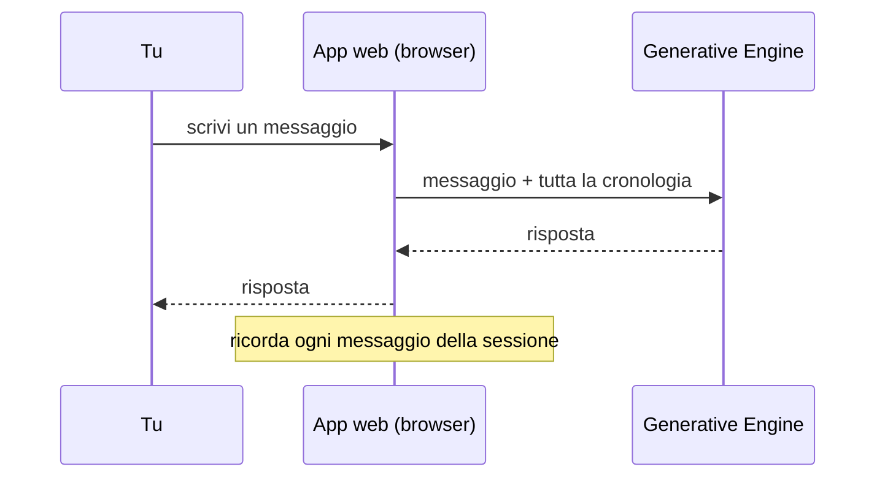
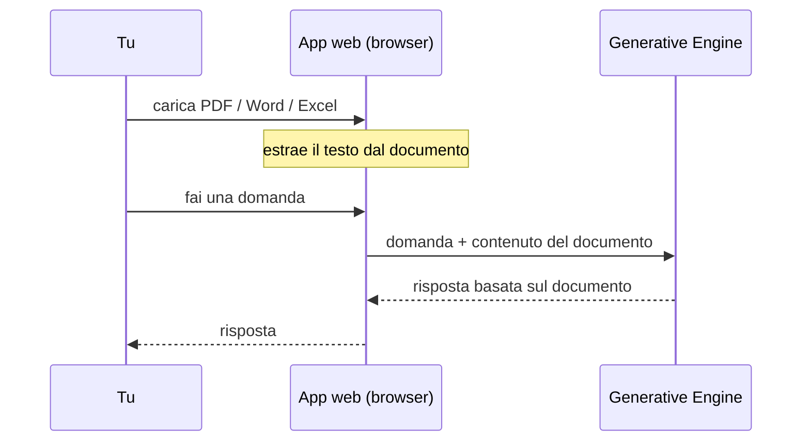
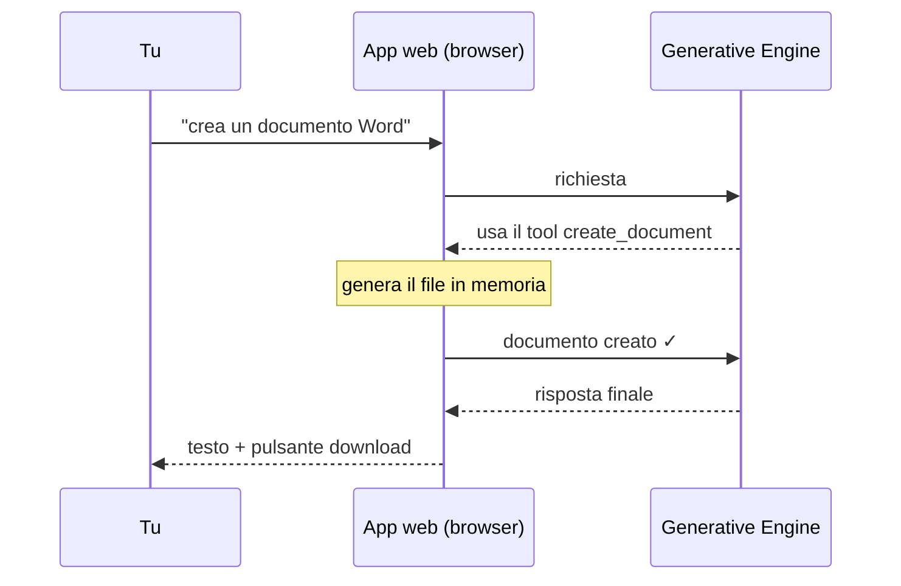

# Generative Engine — Lesson

Questo repository contiene il materiale per una lezione pratica su come costruire un chatbot e poi un agente usando il **Generative Engine di Capgemini**.

Il codice è suddiviso in branch che rappresentano gli step progressivi della lezione. Ogni branch è un'applicazione funzionante e autonoma.

---

## Prerequisiti

---

# Parte 1 — Gli strumenti: VS Code e uv

## 1.1 VS Code
**VS Code** (Visual Studio Code) è l'editor dove scriviamo ed eseguiamo il codice. È gratis.
- Scaricalo da *portale aziendale* e installalo.
- Apri VS Code → menu **File → Apri cartella…** e scegli la cartella del tuo progetto.
- Installa l'estensione **Python** (icona dei quadratini a sinistra → cerca "Python").

## 1.2 uv — cos'è e perché
**uv** è lo strumento che:
- crea il progetto,
- installa le librerie (i "mattoncini" già pronti),
- avvia i programmi con le librerie giuste.

Pensa a uv come al "gestore" del progetto: gli dici *cosa ti serve* e lui si occupa del resto, sempre allo stesso modo su ogni computer (= **riproducibile**).

### Installare uv (Windows)
Apri il **PowerShell** (cercalo nel menu Start) e incolla:
```powershell
irm https://astral.sh/uv/install.ps1 | iex
```
Chiudi e riapri il terminale, poi verifica con `uv --version`.

### I 4 comandi che useremo (nel terminale di VS Code)
| Comando | Cosa fa |
|---|---|
| `uv init` | Crea un nuovo progetto nella cartella corrente |
| `uv add openai streamlit python-dotenv` | Aggiunge le librerie che ci servono |
| `uv sync` | Reinstalla tutte le librerie (utile se scarichi un progetto già fatto) |

> Il terminale in VS Code si apre da: menu **Terminale → Nuovo terminale**.

---

## Come clonare il repository

```bash
git clone https://github.com/markpast92/generative-engine-lesson.git
cd generative-engine-lesson
```

## Come passare da un branch all'altro

```bash
# Vedere tutti i branch disponibili
git branch -a

# Passare a un branch specifico
git checkout simple-call
git checkout simple-chatbot
git checkout chatbot-with-doc-upload
git checkout agent-with-tools
```

## Setup iniziale (per ogni branch)

Crea un file `.env` nella cartella del progetto con la tua chiave API:

```
GEN_ENGINE_API_KEY=la-tua-chiave-api
```

La tua chiave si trova nel portale aziendale del Generative Engine di Capgemini.

https://generative.engine.capgemini.com/

Nella sezione studio -> My API Keys and Usage

Poi installa le dipendenze e avvia l'app:

```bash
uv sync
streamlit run app.py   # per tutti i branch tranne simple-call
python main.py         # solo per il branch "simple-call"
```

---

## Struttura dei branch

| Branch | Descrizione |
|---|---|
| `simple-call` | Prima chiamata all'API - script Python minimale |
| `simple-chatbot` | Chatbot Streamlit con cronologia della conversazione |
| `chatbot-with-doc-upload` | Chatbot + upload PDF/Word/Excel come knowledge base |
| `agent-with-tools` | Agente con tool calling e generazione documenti |
| `live-lesson` | Punto di partenza vuoto per la lezione live |



---

## I Prompt

Ogni step della lezione è definito da un prompt da incollare in un LLM (es. Agenti di Generative Engine, Copilot, ecc). I prompt sono progettati per un linguaggio semplice e funzionano anche con modelli meno capaci.

Il modo di usarli: vai su [agenti di generative engine](https://generative.engine.capgemini.com/agents) o il tuo LLM preferito, incolla il contenuto del prompt e ottieni i file completi pronti all'uso.

---

### Prompt 0 — Prima chiamata API

**File:** [`prompt_0.md`](prompt_0.md)  
**Branch di riferimento:** `simple-call`

Genera uno script Python minimale (`main.py`) che si connette al Generative Engine di Capgemini, invia un messaggio e stampa la risposta in console.



**Come si usa:** incolla il contenuto di `prompt_0.md` in un LLM.

**File generati:** `main.py`

---

### Prompt 1 — Chatbot Streamlit

**File:** [`prompt_1.md`](prompt_1.md)  
**Branch di riferimento:** `simple-chatbot`

Trasforma la chiamata API in un chatbot Streamlit completo con interfaccia web, cronologia della conversazione e system prompt configurabile.



**Come si usa:** incolla il contenuto di `prompt_1.md` in un LLM, sostituendo il placeholder `[inserire il main di April]` con il contenuto del `main.py` generato nel passo precedente.

**File generati:** `app.py`, `config.py`, `engine.py`

---

### Prompt 2 — Upload documenti

**File:** [`prompt_2.md`](prompt_2.md)  
**Branch di riferimento:** `chatbot-with-doc-upload`

Aggiunge al chatbot la possibilità di caricare file PDF, Word ed Excel come knowledge base. Il modello legge i documenti caricati e risponde in base al loro contenuto.



**Come si usa:** incolla il contenuto di `prompt_2.md` in un LLM, sostituendo il placeholder con i tre file (`app.py`, `config.py`, `engine.py`) generati nel passo precedente.

**File generati:** `app.py`, `config.py`, `engine.py`, `extractor.py`

---

### Prompt 3 — Agente con tool calling

**File:** [`prompt_3.md`](prompt_3.md)  
**Branch di riferimento:** `agent-with-tools`

Trasforma il chatbot in un **agente** capace di ragionare in più iterazioni, chiamare tool e generare documenti PDF, Word ed Excel scaricabili direttamente dall'interfaccia.



**Come si usa:** incolla il contenuto di `prompt_3.md` in un LLM, sostituendo il placeholder con i quattro file (`app.py`, `config.py`, `engine.py`, `extractor.py`) generati nel passo precedente.

**File generati:** `app.py`, `config.py`, `engine.py`, `extractor.py`, `generator.py`

---

## Esempio di domande da fare all'agente (branch `agent-with-tools`)

- "Crea un documento Word con un piano d'azione per il prossimo trimestre"
- "Genera un foglio Excel con le spese mensili per i prossimi 6 mesi"
- "Scrivi una policy aziendale in PDF sull'uso degli strumenti AI"
- "Riassumi questo documento" (dopo aver caricato un file dalla sidebar)
