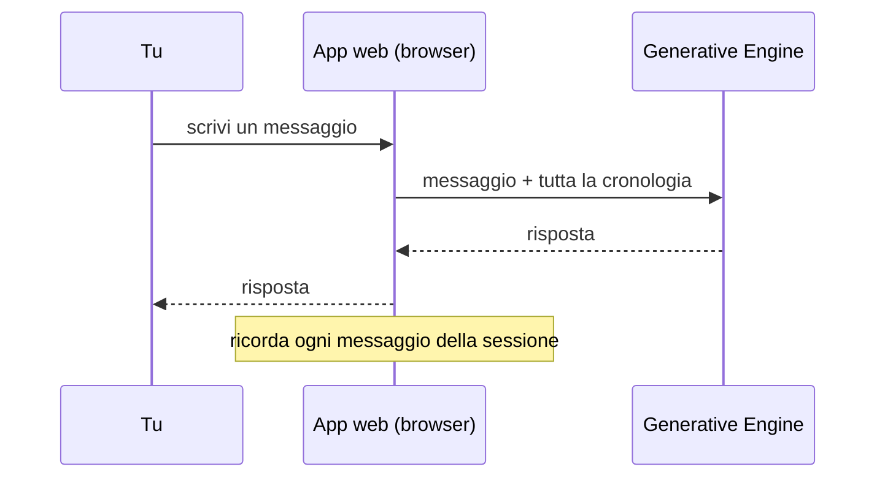

# Step 2 — Chatbot Streamlit

Chatbot web con interfaccia Streamlit, cronologia della conversazione e system prompt configurabile.



---

## Cosa fa

- Interfaccia web con chat in tempo reale (Streamlit)
- Mantiene la cronologia della conversazione durante la sessione
- System prompt e modello configurabili in `config.py`
- Gestione degli errori di connessione e timeout

## File

```
app.py        # interfaccia Streamlit
config.py     # API key, modello, system prompt
engine.py     # funzione reply() che chiama il modello
```

---

## Come eseguire

1. Crea un file `.env` nella cartella del progetto:
   ```
   GEN_ENGINE_API_KEY=la-tua-chiave-api
   ```

2. Installa le dipendenze:
   ```bash
   uv sync
   ```

3. Avvia l'app:
   ```bash
   uv run streamlit run app.py
   ```

4. Apri il browser su `http://localhost:8501`

---

## Come è stato creato

Generato con `prompt_1.md` — disponibile nel branch `main`.  
Punto di partenza: codice di `simple-call`.

Per vedere il passo successivo: `git checkout chatbot-with-doc-upload`
