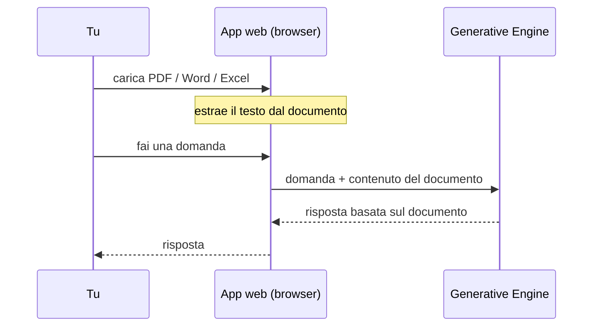

# Step 3 — Chatbot con Upload Documenti

Chatbot Streamlit con la possibilità di caricare file PDF, Word ed Excel come knowledge base. Il modello risponde in base al contenuto dei documenti caricati.



---

## Cosa fa

- Upload multiplo di file PDF, DOCX, XLSX dalla sidebar
- Estrazione automatica del testo dai documenti caricati
- Testo estratto passato al modello come contesto aggiuntivo
- Il modello risponde tenendo conto dei documenti
- Possibilità di confrontare due modelli:
  - `amazon.nova-lite-v1:0` — più veloce e economico
  - `anthropic.claude-sonnet-4-6` — più preciso

## File

```
app.py          # interfaccia Streamlit con sidebar upload
config.py       # API key, modello, system prompt
engine.py       # funzione reply() con supporto knowledge base
extractor.py    # estrazione testo da PDF, DOCX, XLSX
```

---

## Come eseguire

1. Crea un file `.env` nella cartella del progetto:
   ```
   GEN_ENGINE_API_KEY=la-tua-chiave-api
   ```

2. Installa le dipendenze:
   ```bash
   uv sync
   ```

3. Avvia l'app:
   ```bash
   uv run streamlit run app.py
   ```

4. Carica un documento dalla sidebar e fai domande sul suo contenuto.

---

## Come è stato creato

Generato con `prompt_2.md` — disponibile nel branch `main`.  
Punto di partenza: codice di `1-simple-chatbot`.

Per vedere il passo successivo: `git checkout 3-agent-with-tools`
