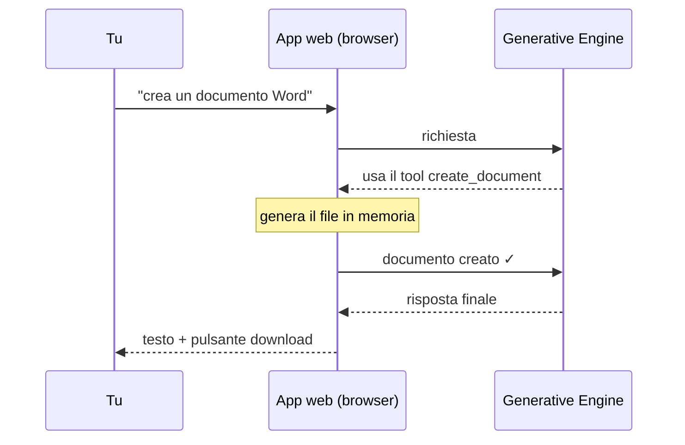

# Step 4 — Agente con Tool Calling

Assistente agentico completo con ciclo iterativo, tool calling e generazione di documenti PDF, Word ed Excel scaricabili direttamente dall'interfaccia.



---

## Cosa fa

- **Agentic loop**: il modello ragiona in più iterazioni prima di rispondere
- **Tool calling**: il modello decide autonomamente quando creare un documento
- **Generazione documenti**: PDF, DOCX e XLSX generati in memoria e scaricabili
- **Knowledge base**: upload di file PDF/Word/Excel come contesto per le risposte
- **Status panel**: mostra in tempo reale i passi intermedi dell'elaborazione

## File

```
app.py          # interfaccia Streamlit con status panel e download button
config.py       # API key, modello, MAX_TOKENS
engine.py       # agentic loop + tool calling + gestione eventi
generator.py    # generazione PDF/DOCX/XLSX in memoria (BytesIO)
extractor.py    # estrazione testo da PDF/DOCX/XLSX caricati
```

---

## Come eseguire

1. Crea un file `.env` nella cartella del progetto:
   ```
   GEN_ENGINE_API_KEY=la-tua-chiave-api
   ```

2. Installa le dipendenze:
   ```bash
   uv sync
   ```

3. Avvia l'app:
   ```bash
   uv run streamlit run app.py
   ```

4. Prova a chiedere al modello di creare documenti, per esempio:
   - "Crea un documento Word con un piano d'azione per il prossimo trimestre"
   - "Genera un foglio Excel con le spese mensili per i prossimi 6 mesi"
   - "Scrivi una policy in PDF sull'uso degli strumenti AI"

---

---

## Come è stato creato

Generato con `prompt_3.md` — disponibile nel branch `main`.  
Punto di partenza: codice di `2-chatbot-with-doc-upload`.
