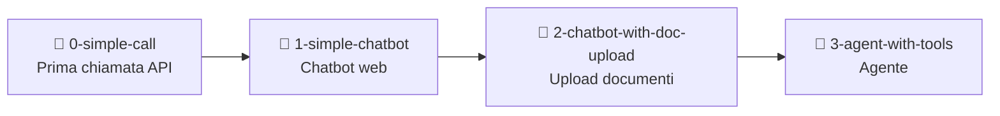

# Generative Engine — Lesson

Materiale per una lezione pratica su come costruire un chatbot e un agente con il **Generative Engine di Capgemini**.

---

## Come usare questo repository

Questo branch (`main`) è il punto di ingresso: contiene i **prompt** da usare durante la lezione e i **documenti di test**.

Il codice funzionante è nei branch numerati — clonali e naviga tra loro man mano che procedi:

```bash
git clone https://github.com/markpast92/generative-engine-lesson.git
cd generative-engine-lesson

git checkout 0-simple-call           # Step 1 — prima chiamata API
git checkout 1-simple-chatbot        # Step 2 — chatbot web
git checkout 2-chatbot-with-doc-upload  # Step 3 — upload documenti
git checkout 3-agent-with-tools      # Step 4 — agente con tool calling
```

Per ogni branch: crea un `.env` con `GEN_ENGINE_API_KEY=la-tua-chiave`, poi `uv sync` e avvia.

> La tua chiave API si trova su [generative.engine.capgemini.com](https://generative.engine.capgemini.com/) → Studio → My API Keys and Usage

---

## Struttura dei branch



---

## I Prompt

Ogni step si costruisce incollando il prompt corrispondente in un LLM (es. [Agenti di Generative Engine](https://generative.engine.capgemini.com/agents)).

| File | Cosa genera | Branch |
|---|---|---|
| [`prompt_0.md`](prompt_0.md) | `main.py` — prima chiamata API | `0-simple-call` |
| [`prompt_1.md`](prompt_1.md) | `app.py`, `config.py`, `engine.py` — chatbot Streamlit | `1-simple-chatbot` |
| [`prompt_2.md`](prompt_2.md) | + `extractor.py` — upload documenti | `2-chatbot-with-doc-upload` |
| [`prompt_3.md`](prompt_3.md) | + `generator.py` — agente con tool calling | `3-agent-with-tools` |

> Ogni prompt ha un placeholder `[inserire i file prodotti in precedenza]`: incolla i file generati nello step precedente prima di mandarlo all'LLM.

---

## Documenti di test (`doc_test/`)

Tre documenti di esempio da caricare nell'app per testare la knowledge base:

| File | Formato | Contenuto |
|---|---|---|
| `policy_aziendale.pdf` | PDF | Policy aziendale di esempio |
| `policy_aziendale.docx` | Word | Stessa policy in formato Word |
| `note_spese.xlsx` | Excel | Foglio note spese di esempio |

Usali nei branch `2-chatbot-with-doc-upload` e `3-agent-with-tools` per fare domande sul contenuto.
